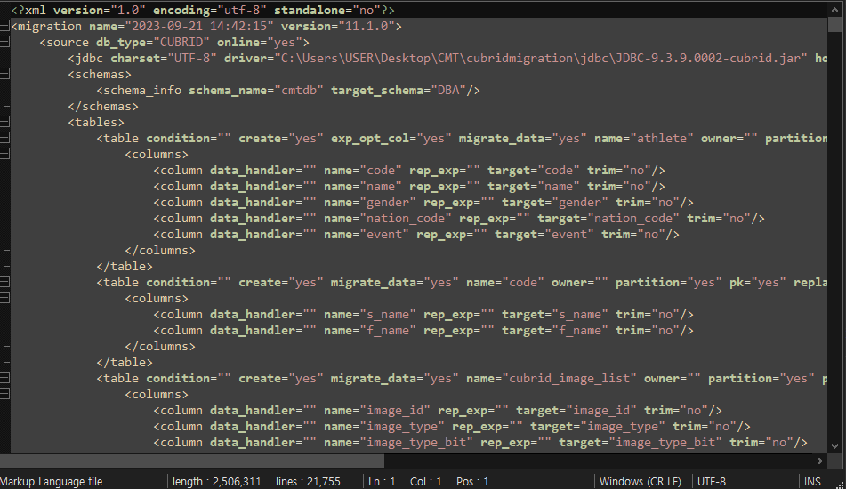
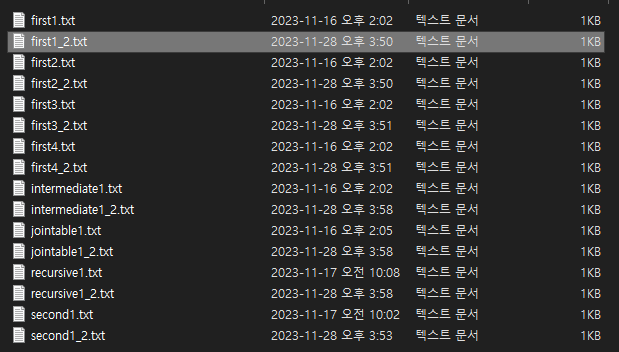
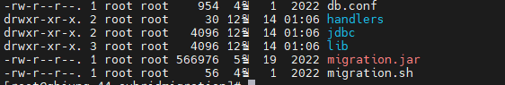

:meta-keywords: guide tool
:meta-description: Introducing the feature which CDC migration

**************************************
CDC 이관 준비
**************************************

======================
script
======================

CDC 기능은 스크립트를 통하여 진행된다.

따라서 CDC기능을 사용하는 CUBRID DBMS를, GDB에 최소 한번 이관해야 한다.

script 파일은 xml 형식이며 이관을 수행하면 자동으로 생성된다.

.. note::
    script파일은 아래의 경로에 생성된다
    ${MiT_workspace}/workspace/cmt/script/*.script

=========================
Agent 에서 출력한 파일
=========================

CUBRID에서 CDC기능을 사용하여 변경된 데이터를 가져오기 위해서는 C API를 사용해야 한다.

Agent를 CUBRID가 설치된 Linux서버에서 실행하면 Agent에 중단 명령을 내릴때까지 계속해서 데이터를 추출한다.

현재 CDC 기능을 수행하면 RDB 기준 insert된 데이터만 가져온다, 즉 delete, update된 정보는 가져오지 않는다.

출력 예시는 아래와 같다.

.. note::
    Agent가 데이터 파일을 출력하는 위치는 "${CUBRID}/cdc_output/" 이다. 간단한 txt 형식으로 출력된다.

==============
MiT CLI 버전
==============

CDC 기능은 CLI 이관과 입력 command 차이만 있을 뿐 큰 틀은 CLI 이관과 동일하다. 따라서 MiT CLI 버전과 실행 환경이 필요하다.

윈도우, 리눅스 둘 다 진행이 가능하다.

Linux MiT는 아래와 같은 구성 요소를 가진다.

