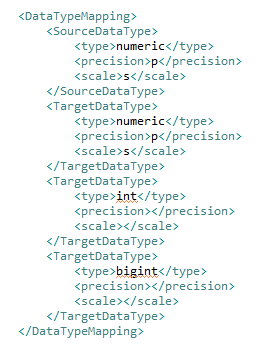
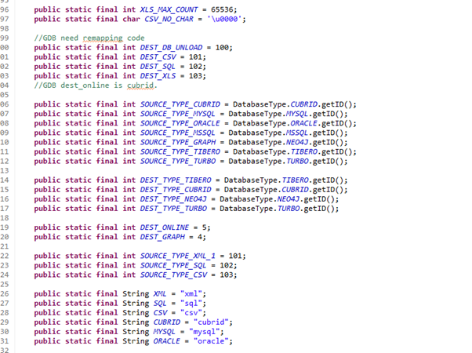
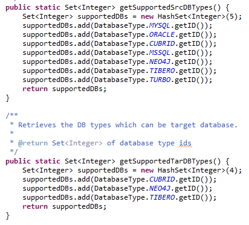

:meta-keywords: guide tool
:meta-description: develop guide

*************
개발 가이드
*************

MiT에 새로운 DB를 추가할 때 구현해야 하는 class와 method에 대한 정보를 설명한다.

=============
DBConstant
=============

DB 관련하여 고정적으로 필요한 정보들을 저장하는 객체

- 추가한 DB의 DBTYPE 정보를 입력한다
- DB_NAMES에 추가할 DB 이름을 입력한다
- JDBC class 정보를 추가한다
- DB에서 사용하는 포트 정보를 추가한다

.. image:: ./image/dbconstant.png

================
DatabaseType
================

추가할 DB의 database객체를 생성하여 static으로 등록한다

생성자에 전달하는 정보는 다음과 같다

- Integer databaseTypeID: DBConstant의 DB_TYPE 값
- String defaultDBSystemName: DBcontant.DB_NAMES에 추가한 해당 DB이름
- String[] jdbcClass: DBconstant에서 추가한 DB의 jdbc 클래스
- String defaultJdbcPort: DBConstant에서 추가한 DB의 기본 jdbc port
- AbstractJDBCSchemaFetcher dbObjectBuilder: 추가할 DB의 schema fetcher
- DBExportHelper dbExportHelper: 추가할 DB의 export helper
- IConnHelper conHelper: 추가할 DB의 Database클래스에서 구현한 ConnHelper
- boolean supportJDBCEncoding: jdbc의 인코딩 지원 여부

대부분의 파라미터는 DBConstant에 작성해놓은 내용을 사용하기 때문에 DBConstant 클래스를 먼저 작성하는 것이 권장된다.

-------------
ConnHelper
-------------

DB의 연결 객체(Connection)를 생성, 관리하는 클래스이다.

DatabaseType 내부에 inner class로 존재한다.

- String makeUrl: parameter로 connParameters를 사용하여 jdbc 연결 url을 return하는 메소드
- Connection createConnection: parameter로 connParameters를 사용하여 connection을 return하는 메소드
- void checkDatabase: parameter로 connetion을 사용해서 간단한 요청을 날려 db가 현재 사용가능한 상태인지를 확인한다

==================
SchemaFetcher
==================

schema와 관련된 정보를 구축하는 클래스이다. metadata나 query를 통해 정보를 조회하여 table, view, sequence등을 구축한다.

graphDB의 경우 table이나 view 같은 object가 없으므로 catalog, schema, sql table정도의 메소드만 사용한다.

=================
ExportHelper
=================

대상 DB에서 데이터를 조회해오는 query를 생성하는 클래스

추가할 DB에 맞게 query를 생성하는 method를 작성하면 된다.

graphDB를 추가할 경우 필요한 메소드의 예시는 다음과 같다

- vertex로 변환될 table의 record를 조회하는 query
- Edge로 변환될 FK 연결 정보를 조회하는 query
- join edge로 변환될 table의 record를 조회하는 query
- 위에 출력될 결과물들을 csv버전으로 추출하는 query

=========================
Exporter
=========================

원본 DB에서 값을 추출해오는 기능을 수행하는 클래스

query를 만드는 것은 exportHelper에서 수행하고 추출 및 record화 시키는 것은 exporter class에서 수행한다.

=========================
Importer
=========================

-------------------------
LoadFileImporter
-------------------------

추출한 record를 csv 형태로 출력할 때 이 class에서 추가해야 할 내용이 있다. 해당 method는 LoadFileImporter class에 구현되어 있다

- handleListFileHeader: 배치 실행을 위해 sh형태로 csv 입력 명령어를 작성하는 method
- writeGraphHeader: csv파일의 첫 줄(header)을 해당 DB가 인식 할 수 있는 형태로 작성하는 method

-------------------------
GraphJDBCImporter
-------------------------

온라인 이관으로 데이터를 대상 DB에 넣는 경우 record를 받아서 이 class에서 statement를 생성한 다음 값을 bind하여 query를 실행한다.

추가하는 DB가 다른 타입의 GQL을 필요로 하는 경우 이 class의 method를 수정해서 사용한다.

========================
TypeMapHelper
========================

DB간의 이관 시 데이터 타입 매칭을 관리하는 클래스

type mapping xml 파일을 미리 작성할 필요가 있다

- type mapping이 미리 작성된 xml 파일을 로드하는 생성자 작성
- 원본 DB에서 data type과 precision, scale을 전달하면 대상 DB에서 사용하는 data type을 return하는 메소드

-------------------------------
type mapping xml
-------------------------------

원본 DB에서 대상 DB로 이관을 진행할 때, data type을 지정하는 파일

형식은 다음 사진과 같다

1:n 작성이 가능하며 추후 MiT를 실행하고 설정 페이지에서 수정 할 수 있다.

==============
DataConvert
==============

기존에는 date, time, timestamp같은 값을 cubrid에 맞게 변경하는 method를 가지고 있었으나 graphDB는 data type이 느슨하기 때문에 추가로 method를 구현하지 않아도 된다.

만약 필요한 경우 method를 구현하여 사용한다.

===============================
MigrationConfiguration
===============================

추가할 DB의 ID를 설정한다.

ID를 추가함에 따라 몇 가지 메소드를 수정할 필요가 있다.

- 원본 혹은 대상 DB가 어떤 DB인지 정보를 return하는 메소드
- 원본 혹은 대상 DB가 GDB인지 RDB인지 여부를 return하는 메소드

==================
MigrationWizard
==================

추가한 db의 ID를 getSupportedSrcDBTypes, getSupportedTarDBTypes에 추가해야한다.

=================================
GraphSelectSrcTarTypesView
=================================

UI페이지에서 radio button으로 원본, 대상 DB에 추가할 DB 선택 버튼을 설정한다.