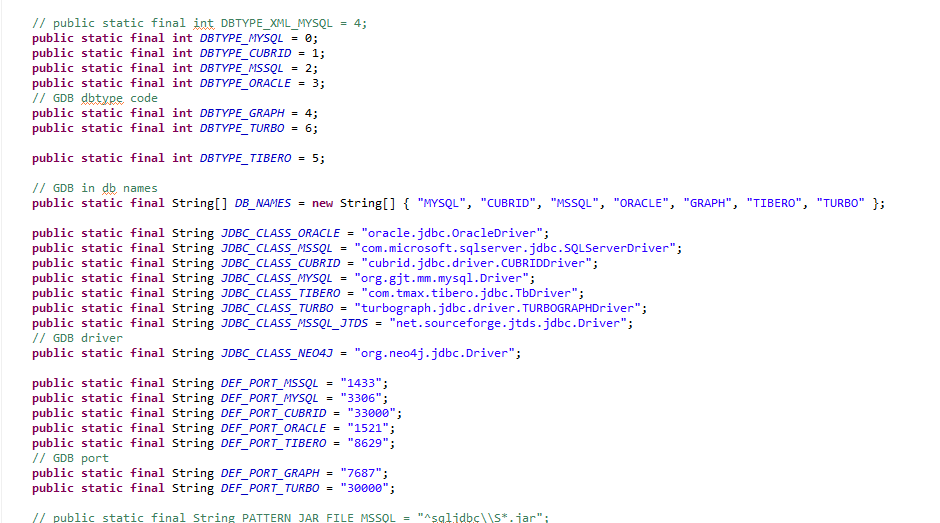

:meta-keywords: guide tool
:meta-description: develop guide

*************
개발 가이드
*************

MiT에 새로운 DB를 추가할 때 구현해야 하는 class와 method에 대한 정보를 설명한다.

=============
DBConstant
=============

JDBC 연결에서 필요한 정보들을 static 형태로 저장하는 class. 추가하는 DB의 정보를 아래와 같은 양식으로 저장한다.

- DBTYPE: 추가한 DB의 id역할을 할 번호를 지정한다. 아래의 DB_NAMES 배열의 index로 사용된다
- DB_NAMES: DB_NAMES에 추가할 DB 이름을 입력한다. 위의 DBTYPE의 index에 입력한다
- JDBC_CLASS: JDBC에서 사용하는 Driver class 정보를 입력한다.
- DEF_PORT: DB에서 사용하는 포트 정보를 입력한다.

================
DatabaseType
================

DatabaseType class는 Database의 부모 class이다. Database관련 정보와 class(export helper, jdbc, sql helper등)를 관리한다.

MiT는 DB의 연결 정보 또는 DB이관에 필요한 정보들을 추가할 DB의 database객체를 생성하여 static으로 등록한다

대부분의 파라미터는 DBConstant에 작성해놓은 내용을 사용하기 때문에 DBConstant 클래스를 먼저 작성하는 것이 권장된다.

-------------
ConnHelper
-------------

DB의 연결 객체(Connection)를 생성, 관리하는 class이다.

DatabaseType 내부에 inner class로 존재한다.

- String makeUrl: parameter로 connParameters를 사용하여 jdbc 연결 url을 return하는 메소드
- Connection createConnection: parameter로 connParameters를 사용하여 connection을 return하는 메소드
- void checkDatabase: parameter로 connetion을 사용해서 간단한 요청을 날려 db가 현재 사용가능한 상태인지를 확인한다

==================
SchemaFetcher
==================

schema와 관련된 정보를 구축하는 클래스이다. metadata나 query를 통해 정보를 조회하여 table, view, sequence등을 구축한다.

원본, 대상 DB에서 meta data 정보를 조회하여 그 값을 기반으로 db object를 구현한다.

graphDB의 경우 table이나 view 같은 object가 없으므로 catalog, schema, sql table정도의 메소드만 사용한다.

=================
ExportHelper
=================

대상 DB에서 데이터를 조회해오는 query를 생성하는 클래스이다 추가하는 DB에 맞게 query를 생성하는 method를 작성하면 된다.

graphDB를 추가할 경우 필요한 메소드의 예시는 다음과 같다

- vertex로 변환될 table의 record를 조회하는 query
- Edge로 변환될 FK 연결 정보를 조회하는 query
- join edge로 변환될 table의 record를 조회하는 query
- 위에 출력될 결과물들을 csv버전으로 추출하는 query

Exporter의 호출로 실행되며 실제 query를 실행하고 이관하는 것은 Exporter에서 이뤄진다

=========================
Exporter
=========================

원본 DB에서 값을 추출해오는 기능을 수행하는 클래스

위의 ExportHelper에서 각 DB에 맞게 query를 생성하고 query 실행 및 record화 시키는 것은 exporter class에서 수행한다.

=========================
Importer
=========================

-------------------------
LoadFileImporter
-------------------------

추출한 record를 csv 형태로 출력할 때 이 class에서 추가해야 할 내용이 있다. 해당 method는 LoadFileImporter class에 구현되어 있다

- handleListFileHeader: 배치 실행을 위해 sh형태로 csv 입력 명령어를 작성하는 method
- writeGraphHeader: csv파일의 첫 줄(header)을 해당 DB가 인식 할 수 있는 형태로 작성하는 method

-------------------------
GraphJDBCImporter
-------------------------

온라인 이관으로 데이터를 대상 DB에 넣는 경우 record를 받아서 이 class에서 statement를 생성한 다음 값을 bind하여 query를 실행한다.

추가하는 DB가 다른 타입의 query를 필요로 하는 경우 이 class의 method를 수정해서 사용한다.

========================
TypeMappingHelper
========================

DB간의 이관 시 데이터 타입 매칭을 관리하는 클래스이다 해당 class에서 type mapping xml파일을 로드해서 사용하기 때문에 파일을 미리 작성할 필요가 있다

- type mapping이 미리 작성된 xml 파일을 로드하는 생성자 작성
- 원본 DB에서 data type과 precision, scale을 전달하면 대상 DB에서 사용하는 data type을 return하는 메소드

-------------------------------
type mapping xml
-------------------------------

원본 DB에서 대상 DB로 이관을 진행할 때, data type을 지정하는 파일이며 형식은 다음 사진과 같다

.. image:: ./image/type_mapping_xml.png

1:N 작성이 가능하며 추후 MiT를 실행하고 설정 페이지에서 수정 할 수 있다.

==============
DataConvert
==============

기존에는 date, time, timestamp같은 값을 cubrid에 맞게 변경하는 method를 가지고 있었으나 graphDB는 data type이 느슨하기 때문에 추가로 method를 구현하지 않아도 된다.

만약 필요한 경우 method를 구현하여 사용한다.

===============================
MigrationConfiguration
===============================

migration 관련 정보 및 설정들을 총합하여 저장하는 class이다. 여기서 추가할 DB의 ID를 설정한다.

.. image:: ./image/migration_config.png

ID를 추가함에 따라 몇 가지 메소드를 수정할 필요가 있다.

- 원본 혹은 대상 DB가 어떤 DB인지 정보를 return하는 메소드
- 원본 혹은 대상 DB가 GDB인지 RDB인지 여부를 return하는 메소드

==================
MigrationWizard
==================

MiT에서 이관 절차에 따라 해당 절차에 맞는 페이지를 읽어온다. 원본, 대상 DB에 따라 불러오는 다음 페이지 값이 달라진다. 

추가한 db의 ID를 getSupportedSrcDBTypes, getSupportedTarDBTypes에 추가해야한다.

.. image:: ./image/migration_wizard.png

=================================
GraphSelectSrcTarTypesView
=================================

최초 MiT를 실행하고 원본, 대상 DB를 선택하는 페이지이다.

UI페이지에서 radio button으로 원본, 대상 DB에 추가할 DB 선택 버튼을 설정한다.