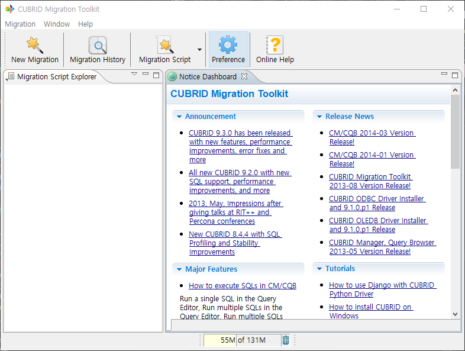
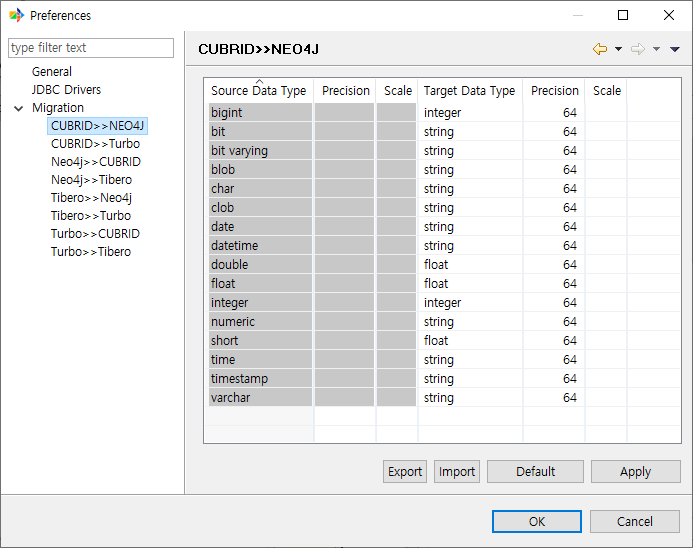
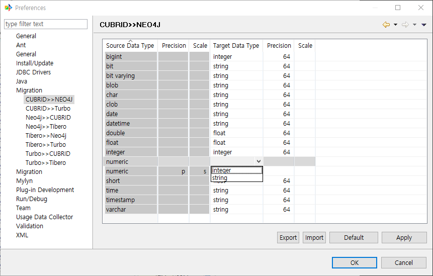

:meta-keywords: guide tool
:meta-description: change data type mapping

************************
Type Mapping 변경
************************

이관 시 대상 DB에 이관되는 값의 데이터 타입을 바꾸고 싶을 때 사용하는 기능이다.

메뉴 진입 방법은 아래와 같다.

1. 설정 메뉴를 선택한다.

2. Migration 메뉴에서 원하는 이관 타입을 선택한다

3. 원하는 데이터 타입 매핑를 선택하여 수정한다.

