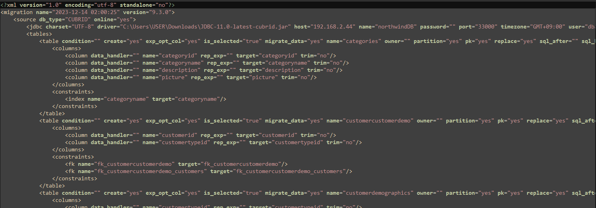
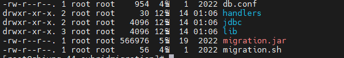

:meta-keywords: guide tool
:meta-description: Introducing the feature: CLI

**************************************
CLI 이관
**************************************

CLI 이관이란 GUI버전의 MiT를 사용할 수 없는 상태에서 script를 사용하여 이관을 하는 기능이다.

.. note::
    CLI 이관에는 script가 필수이다. script는 GUI 환경에서 이관을 실행하면 생성된다. 즉 CLI 이관 기능을 사용하기 위해서는 최소 1회는 GUI 환경에서 이관을 진행해야 한다.

======================
script
======================

script 파일은 xml 형식이며 source, target DB의 접속 정보, sourceDB의 메타 정보 등을 가지고 있다.

.. note::
   script파일은 GUI를 사용한 이관을 진행하면 아래의 경로에 자동 생성된다.
   ${MiT_workspace}/workspace/cmt/script/*.script

==============
MiT CLI 버전
==============

CLI환경에서 실행하려면 MiT CLI 버전과 실행 환경이 필요하다.

윈도우, 리눅스 둘 다 진행이 가능하다.

Linux MiT는 아래와 같은 구성 요소를 가진다.

