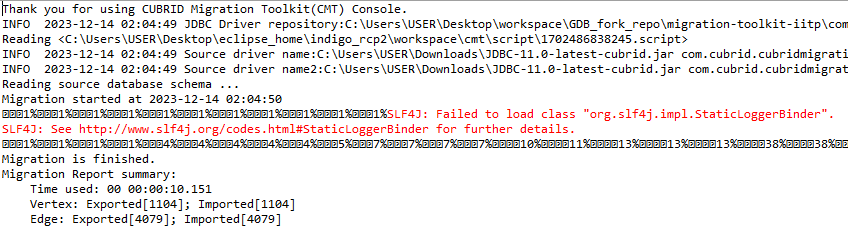

:meta-keywords: guide tool
:meta-description: execute CLI migration feature

****************************************************
CLI 이관 기능 실행
****************************************************

===============
실행 command
===============

아래의 옵션을 작성하여 기능을 실행할 수 있다.

``migration.jar start [script위치]``

예시)

아래와 같이 결과를 확인할 수 있으며 vertex, edge의 export, import 개수가 동일하면 성공적으로 완료된 것이다.

