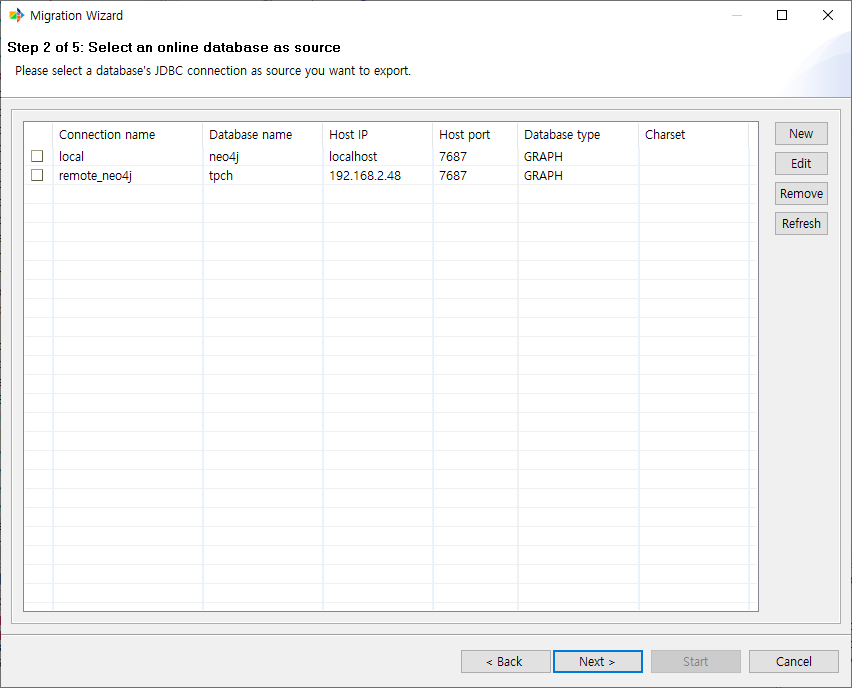
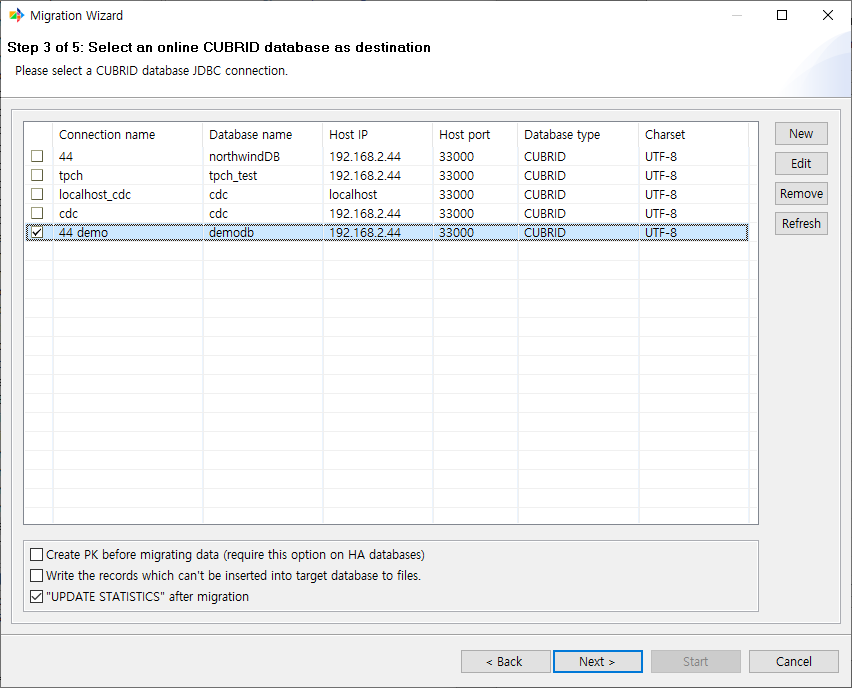

:meta-keywords: guide tool
:meta-description: Introducing the feature G2R's first page

*******************************
GDB to RDB 이관
*******************************

G2R 기능은 Graph DB에 쿼리를 날려 조회된 결과값을 RDB의 테이블로 변형시켜 RDB에 이관하는 기능이다.

==================
sourceDB 선택
==================

G2R 이관이기 때문에 이 경우 source는 GraphDB가 된다.

==================
targetDB 선택
==================

G2R 이관이기 때문에 이 경우 target은 RDB가 된다. 여기서는 CUBRID를 사용하였다.

