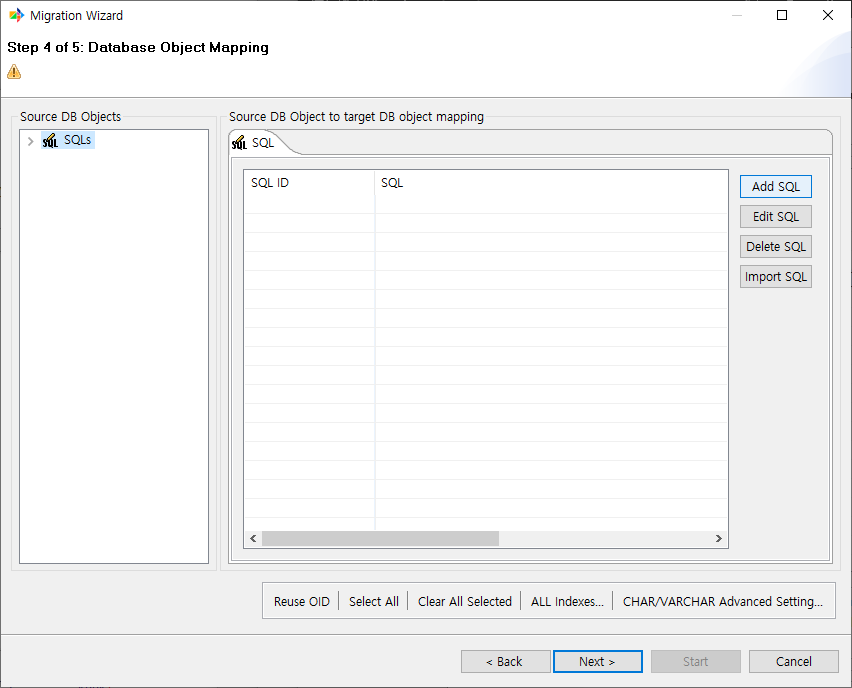
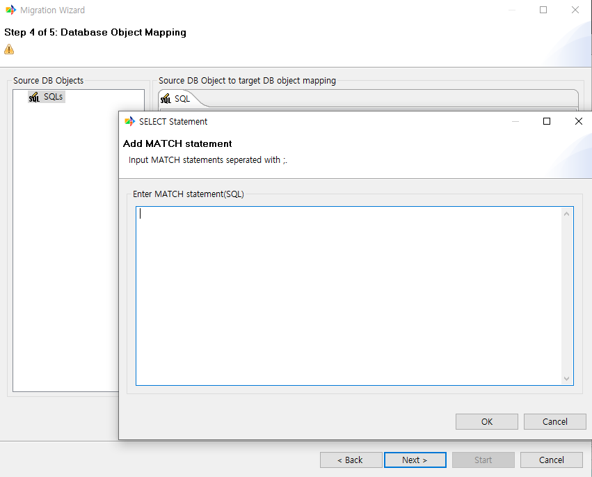
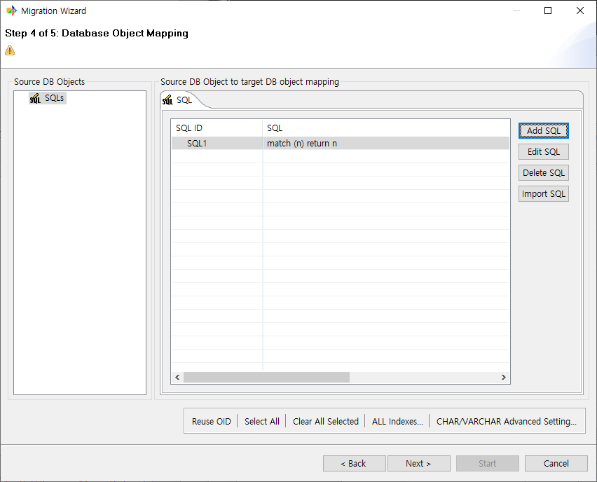
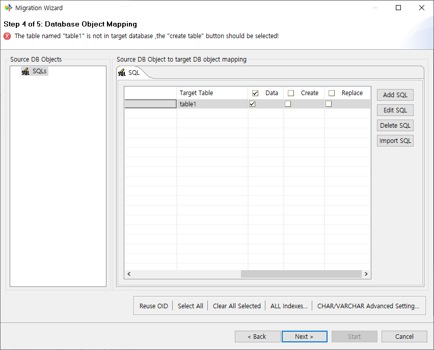
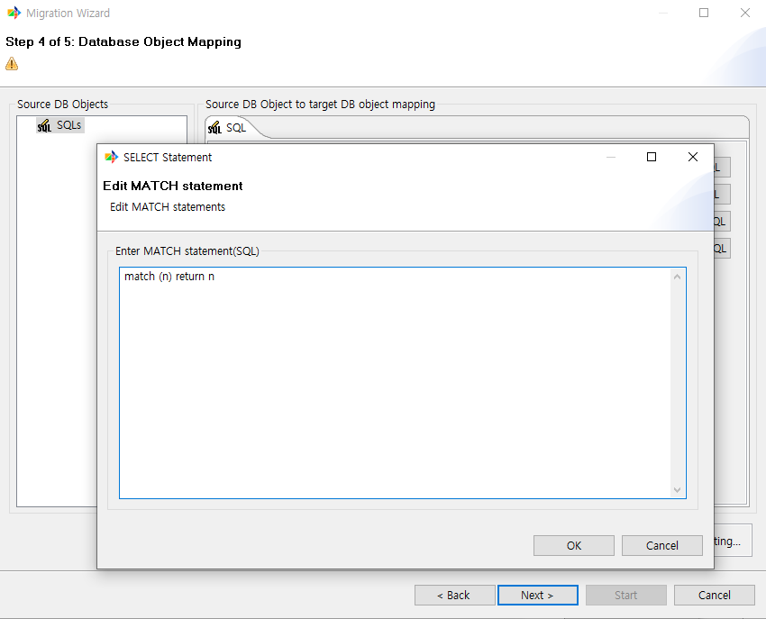
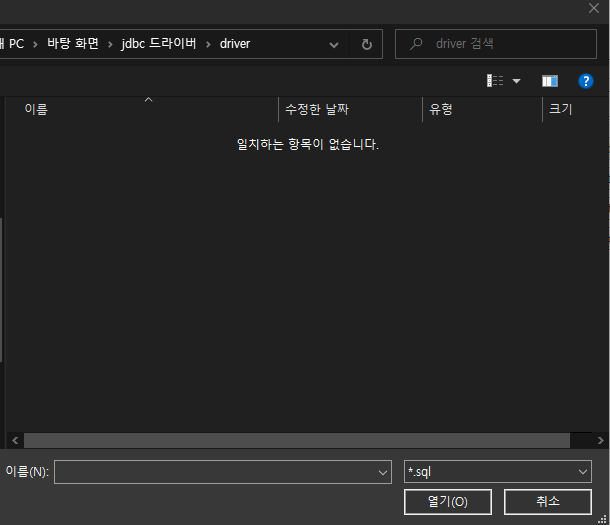

:meta-keywords: guide tool
:meta-description: G2R: GQL

***********************************
GQL 입력 및 값 추출
***********************************

입력한 GQL을 관리하는 dialog이다.

===========================
Add SQL
===========================

GQL을 입력하는 창을 표시한다.

쿼리를 입력하면 위와 같이 표시된다.

옆으로 창을 옮기면 위와 같은 옵션이 있다.

-------------------------------------
Data
-------------------------------------

쿼리로 인해 조회된 데이터의 이관 여부를 결정하는 옵션이다.

-------------------------------------
Create
-------------------------------------

RDB에 Target Table의 이름을 가진 table이 없다면 해당 옵션을 활성화 해야 테이블이 생성된다.

-------------------------------------
Replace
-------------------------------------

만약 이미 RDB에 테이블이 생성되어 있다면 삭제 후 테이블을 다시 만드는 옵션이다.

===========================
Edit SQL
===========================

입력된 쿼리를 수정한다.

===========================
Delete SQL
===========================

입력한 쿼리를 삭제한다.

===========================
import SQL
===========================

외부에서 확장명이 sql인 파일을 로드하여 쿼리를 등록한다.