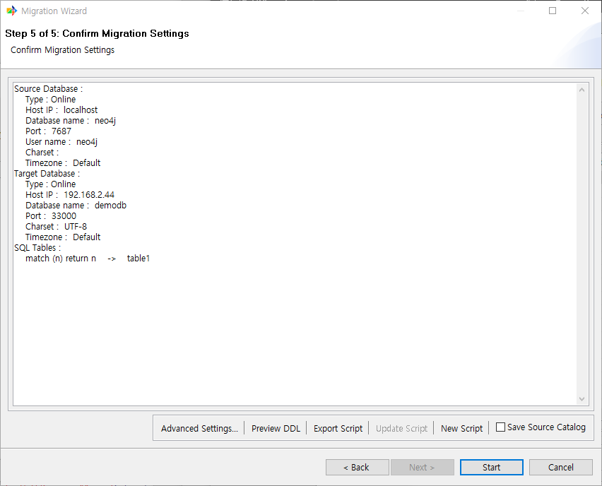

:meta-keywords: guide tool
:meta-description: Introducing the feature G2R's first page

*******************************
GDB to RDB 이관 진행
*******************************

옵션을 선택하면 아래와 같이 최종 확인 페이지가 표시된다

=====================
원본 데이터베이스
=====================

원본 데이터베이스에 대한 연결 정보를 표시한다.

=====================
대상 데이터베이스
=====================

대상 데이터베이스에 대한 연결 정보를 표시한다.

=====================
SQL Tables
=====================

입력했던 쿼리가 어떤 테이블로 이관되는지를 표시해 준다

===================
고급 성능 설정
===================

이관 진행시 사용될 thread 갯수, commit 주기 등을 설정할 수 있다.