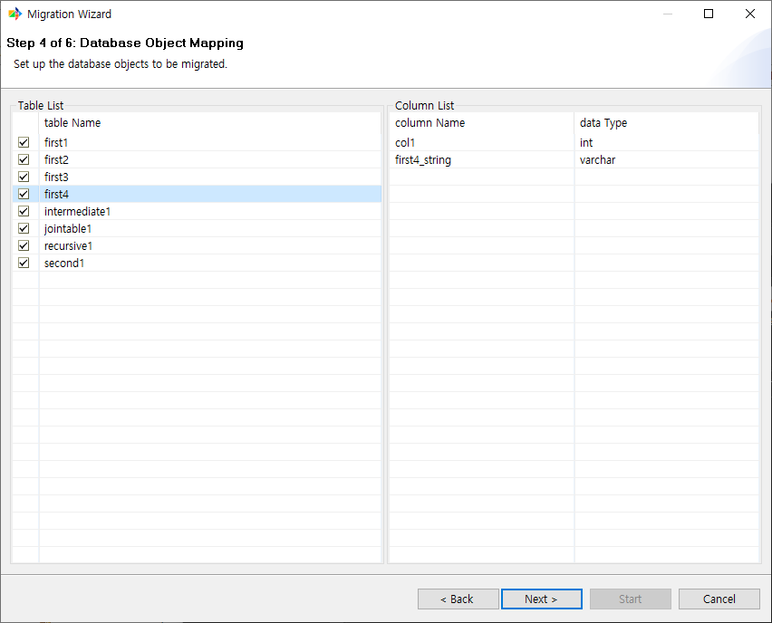
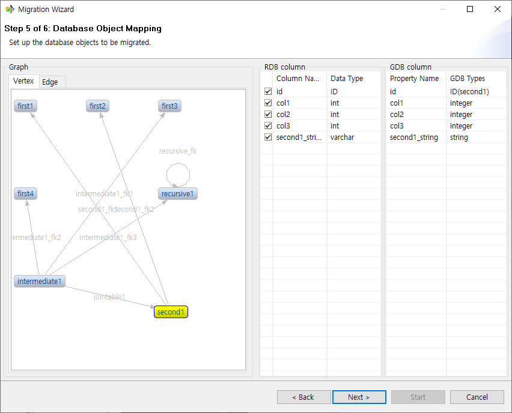

:meta-keywords: guide tool
:meta-description: Introducing the features of object mapping page

*******************************
객체 맵핑 페이지
*******************************

원본 DB의 테이블들 중에 이관하고싶은 테이블을 선택하는 페이지이다.

==============
Table List
==============

원본 DB의 테이블 목록을 표시한다. 각 행을 클릭하여 이관 여부를 지정할 수 있다.

기본적으로 모든 테이블을 이관하도록 설정 되어있다.

==============
Column List
==============

테이블 리스트에서 테이블을 선택한 경우 해당 테이블의 컬럼 정보를 확인할 수 있다.

이관할 테이블을 선택한 후 다음 페이지로 진행한다.

==========
Graph
==========

전 페이지에서 선택된 object들이 csv을 통해 이관될 경우 graphDB에서 어떻게 보이게 될지 예시를 보여준다.

============================
RDB Column, GDB Column
============================

그래프 뷰에서 object를 선택한 경우 해당 object의 RDB에서의 컬럼 정보와 GDB에서의 컬럼 정보를 확인할 수 있다.
