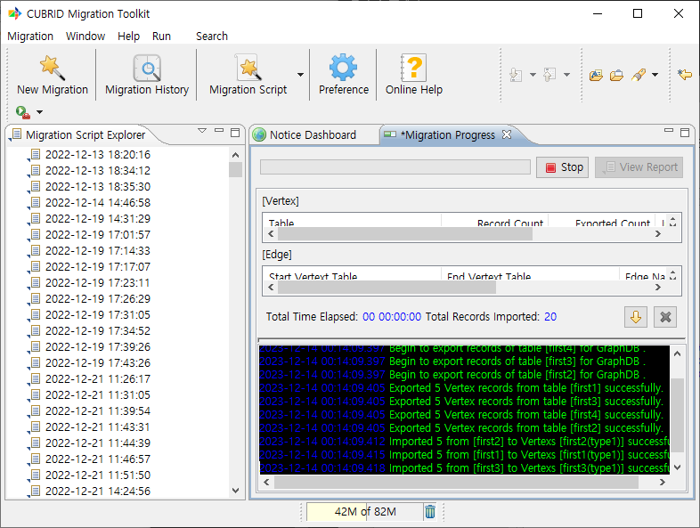
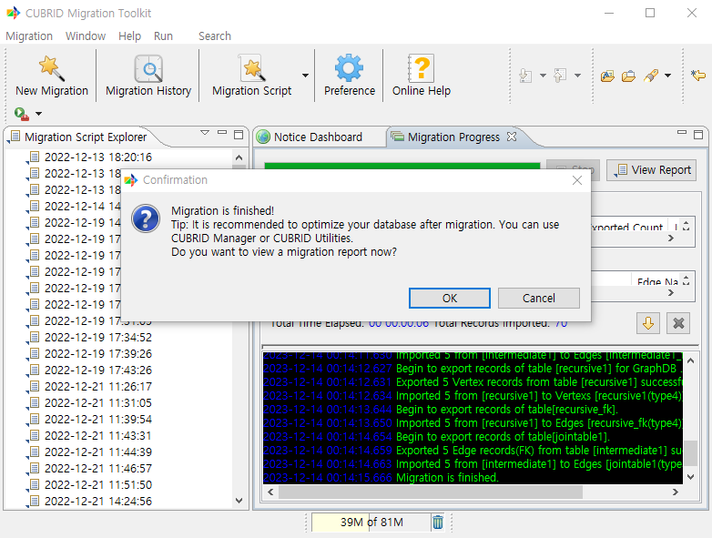

:meta-keywords: guide tool
:meta-description: Introducing the features of migration progress page

************
이관 진행
************

이관 진행 상황을 확인할 수 있는 페이지

========
vertex
========

원본 DB의 테이블 이름과 각 테이블에서 추출되는 vertex 개수, 진행상황 등을 표시한다.

========
Edge
========

원본 DB에서 추출된 FK, join table edge와 이름, 시작 vertex와 끝 vertex를 표시한다.

=============
console 화면
=============

진행 상황을 표시한다. 진행하면서 이관 도중 에러가 발생하는 경우 빨간색으로 내용이 표시된다.

================
이관 완료
================

이관 완료 시 위와 같은 화면이 표시되며 OK를 선택한 경우 결과창을 표시한다.

