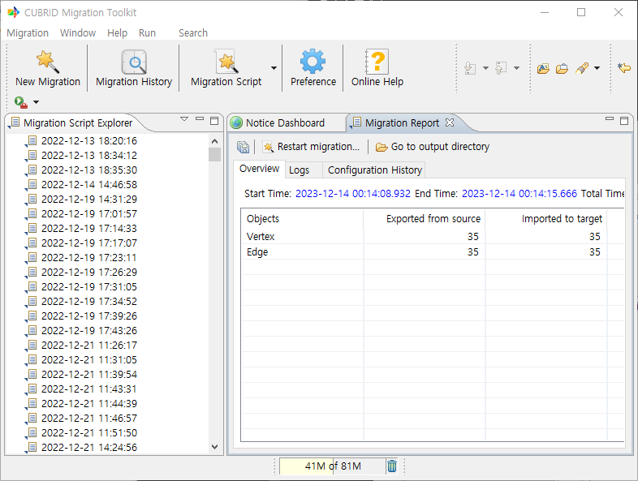
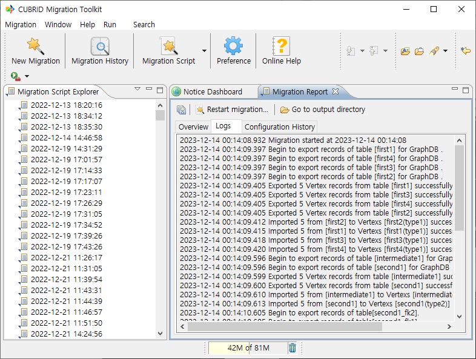
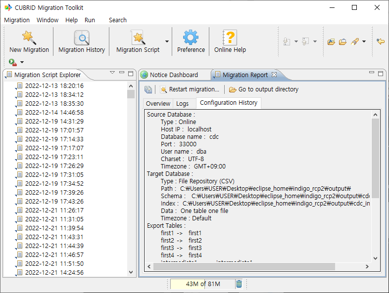
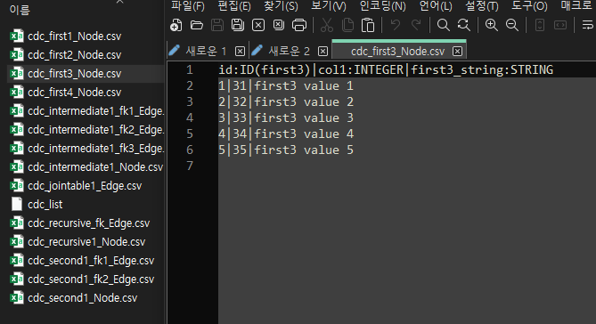

:meta-keywords: guide tool
:meta-description: Introducing the features of migration page

**********************
이관 보고서
**********************

이관 완료 후 결과를 표시한다.

===============
Overview
===============

vertex와 edge의 추출 개수, 입력 개수, 실패한 개수, 진행도 등을 확인할 수 있다.

=========
Logs
=========

이관 진행 페이지에서 console 화면에 표시되었던 내용이 저장된다.

==========================
Configuration History
==========================

이관 확인 페이지에서 표시되었던 정보들을 확인할 수 있다.

==========================
결과 확인
==========================

파일을 확인해 보면 GraphDB에서 로드할 수 있는 형태로 csv 파일이 출력된 것을 확인할 수 있다