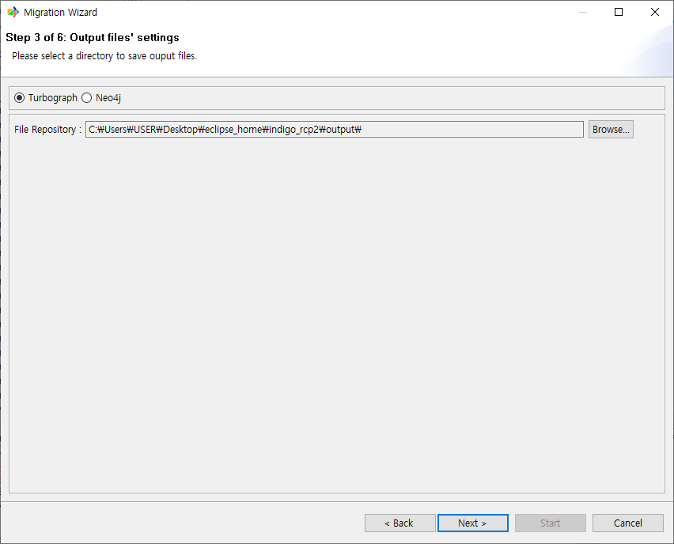

:meta-keywords: guide tool
:meta-description: Introducing the feature R2D's first page

*******************
Dump 파일 설정
*******************

source DB를 선택하고 진행하면 아래와 같은 화면이 표시된다.

=========================
GDB 선택
=========================

상단에 Turbograph와 Neo4j를 선택할 수 있는 라디오 버튼이다.

target으로 사용할 GDB를 선택하면 해당 GDB에 맞는 data type, GQL로 dump file을 출력한다.

=========================
File Repository
=========================

dump file이 출력될 위치를 보여준다.

browse 버튼을 선택하여 위치를 설정할 수 있다.

기본위치는 MiT가 설치된 폴더 밑 output에 생성된다.

.. warning::
    만약 설정한 디렉토리에 같은 이름의 파일이 있으면 삭제하고 다시 생성하게 된다.