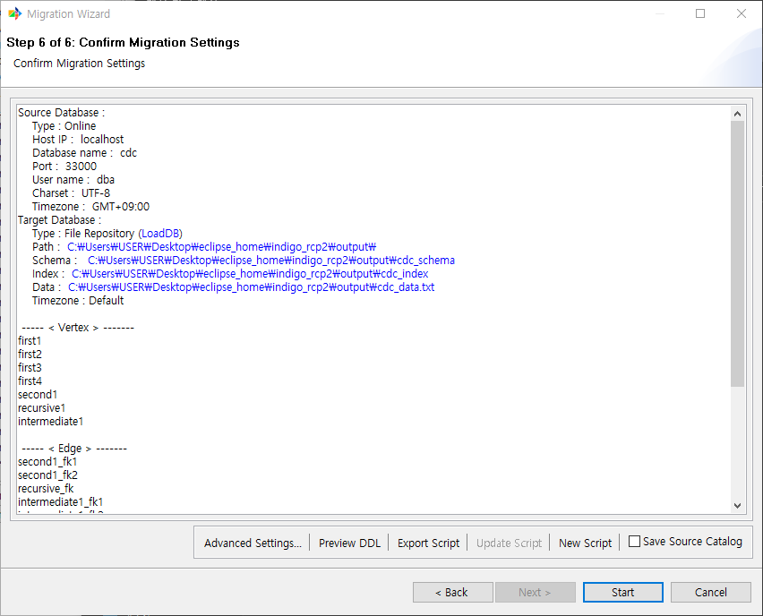
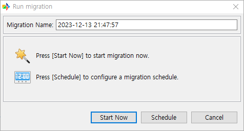

:meta-keywords: guide tool
:meta-description: Introducing the features of migration page

*************************
이관 확인 페이지
*************************

이관할 object들의 정보를 최종적으로 확인한다.

=====================
Source Database
=====================

원본 데이터베이스에 대한 연결 정보를 표시한다.

=====================
Target Database
=====================

대상 데이터베이스에 대한 연결 정보를 표시한다.

=====================
Vertex
=====================

원본 DB에서 vertex로 추출할 table을 표시한다.

=====================
Edge
=====================

원본 DB에서 Edge로 추출할 join table 또는 FK를 표시한다.

=====================
Graph Design
=====================

생성될 그래프를 문자 형식으로 간단히 보여준다.

======================
이관 실행 예약
======================

MiT에서 스크립트 기능이 작동하지 않기 때문에 해당 기능도 작동하지 않는다. 바로 시작하기를 눌러서 진행할 수 있다.

-------------------
Advanced Settings
-------------------

이관 진행시 사용될 thread 갯수, commit 주기 등을 설정할 수 있다.

