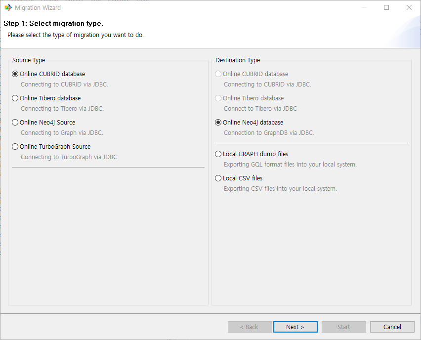

:meta-keywords: guide tool
:meta-description: Introducing the features of select src and tar page

****************************
원본, 대상 DB 선택 페이지
****************************

원본, 대상 DB 선택 페이지에 대해 설명한다.

이관할 원본 DB와 대상 DB를 선택하는 페이지이다.

==========
원본 유형
==========

데이터를 추출할 DB를 선택한다. 현재 CUBRID만 지원하며 추후 GDB->RDB 이관 기능이 추가되면 GDB가 추가될 예정이다

==========
대상 유형
==========

데이터를 이관할 대상 DB를 선택한다. 현재 GDB(NEO4J)만 지원하며 추후 GDB->RDB 이관 기능이 추가되면 RDB(CUBIRD)가 추가될 예정이다
