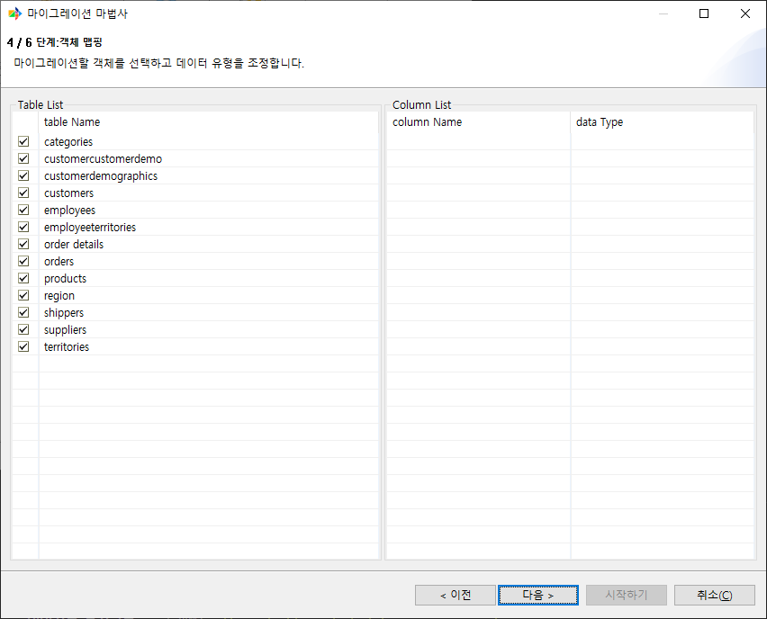
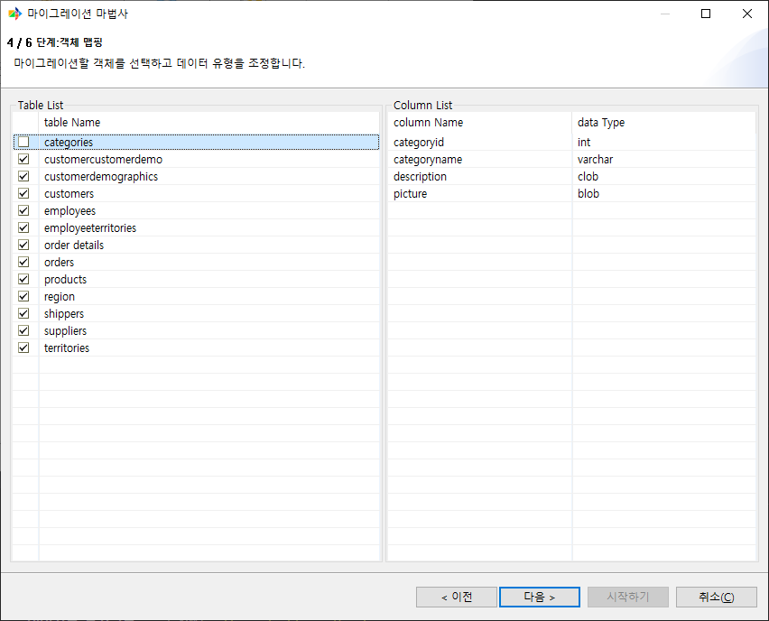
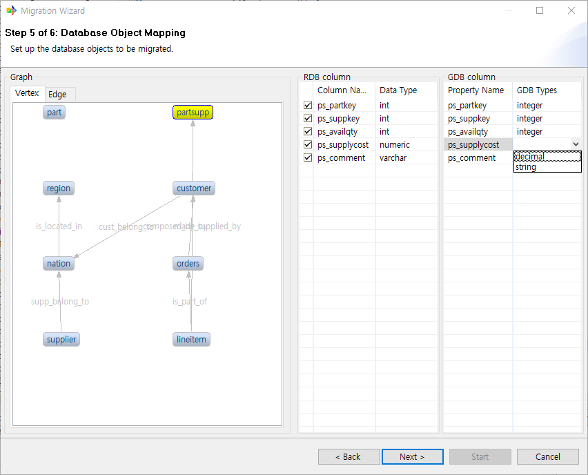
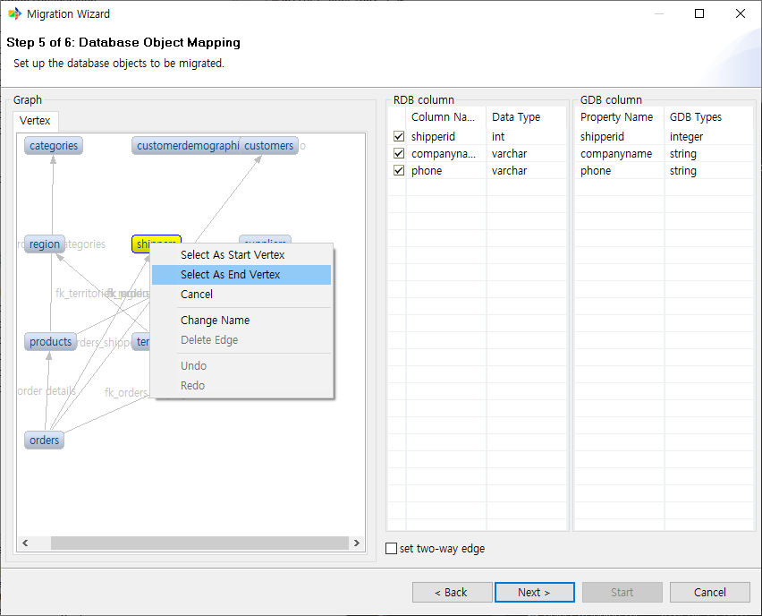
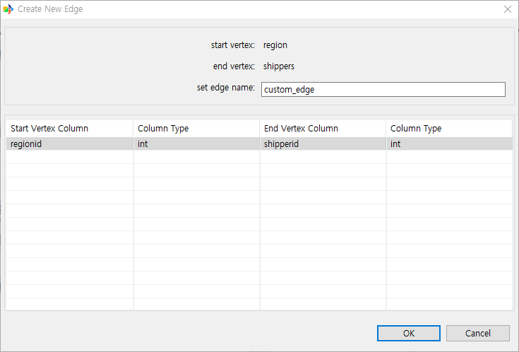
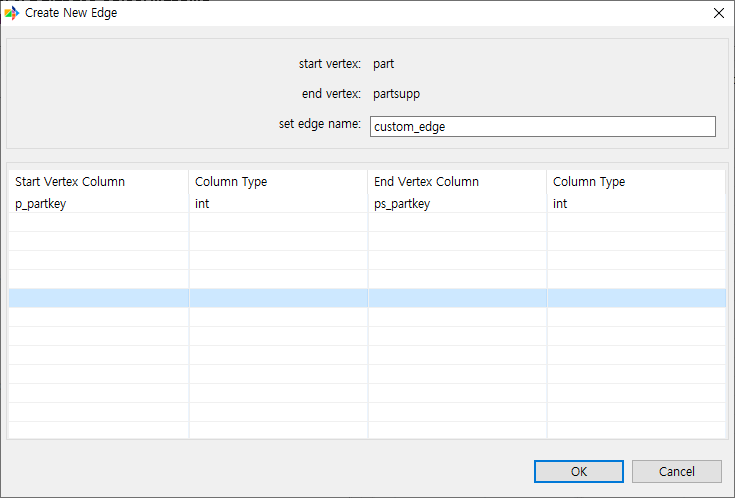
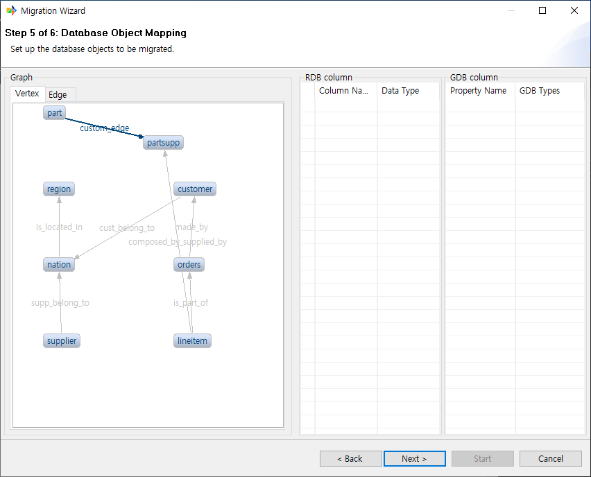

:meta-keywords: guide tool
:meta-description: Introducing the features of object mapping page

*******************************
객체 맵핑 페이지
*******************************

원본 DB의 테이블들 중에 이관하고싶은 테이블을 선택하는 페이지이다.

메뉴얼에서는 northwind sampleDB를 사용하였다.

==============
테이블 리스트
==============

원본 DB의 테이블 목록을 표시한다. 각 행을 클릭하여 이관 여부를 지정할 수 있다.
기본적으로 모든 테이블을 이관하도록 설정 되어있다.

==============
컬럼 리스트
==============

테이블 리스트에서 테이블을 선택한 경우 해당 테이블의 컬럼 정보를 확인할 수 있다.

ex) categories 테이블을 선택한 경우

이관할 테이블을 선택한 후 다음 페이지로 진행한다.

=======
그래프
=======

전 페이지에서 선택된 object들이 이관될 경우 GraphDB에서 어떻게 보이게 될지 예시를 보여준다.

==================
RDB, GDB 컬럼
==================

그래프 뷰에서 object를 선택한 경우 해당 object의 RDB에서의 컬럼 정보와 GDB에서의 컬럼 정보를 확인할 수 있다.

.. image:: ./image/object_mapping_page2.png

==================================
GDB 컬럼 데이터 타입 변경 기능
==================================

GDB column의 특정 데이터 타입은 변경이 가능하다.

현재는 자기 자신의 타입과, string으로의 타입 변경만을 지원한다.

==============================
사용자 지정 edge 추가 기능
==============================

그래프 뷰에서 조건을 만족하는 경우 사용자가 edge를 추가할 수 있다

방법은 아래와 같다

1. 우선 start vertex로 지정할 vertex를 우클릭하여 선택한다.

.. image:: ./image/add_edge_step1.png

2. end vertex로 지정할 vertex도 마찬가지로 우클릭하여 선택한다. start vertex를 선택하였다면 활성화 된다.

3. Create New Edge dialog에서 edge 이름을 입력한다.

4. 아래 테이블에서 FK를 연결할 컬럼을 선택한다. 이때 각 컬럼은 타입이 동일해야 한다.

5. 사용자 지정 edge가 생성된 것을 확인 할 수 있다.

