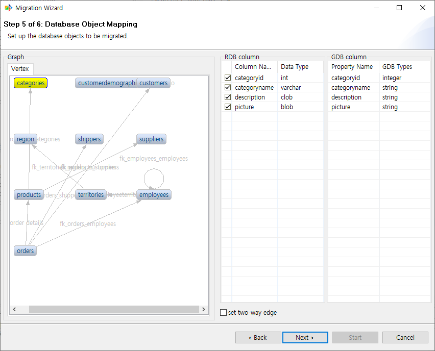
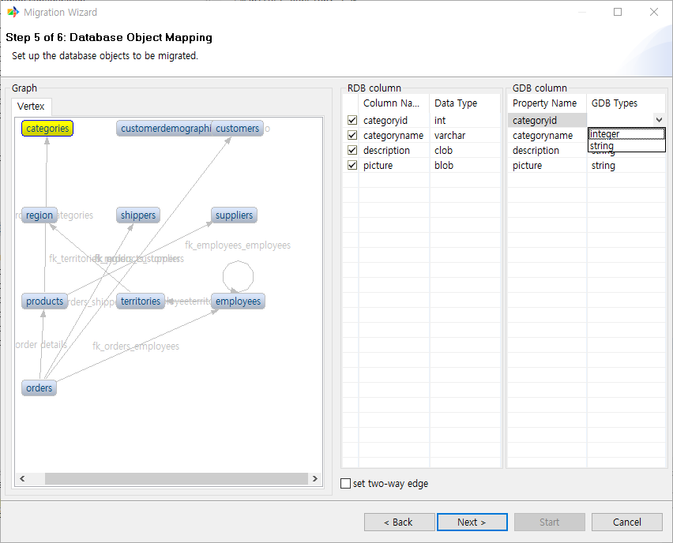
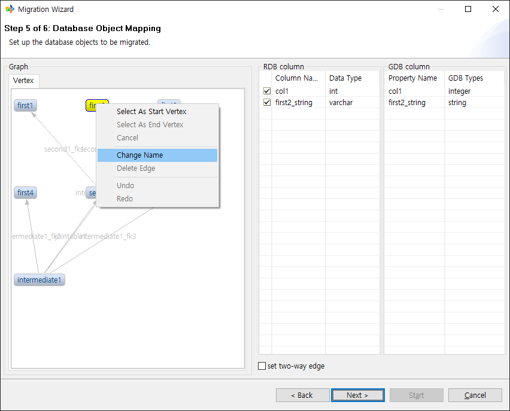
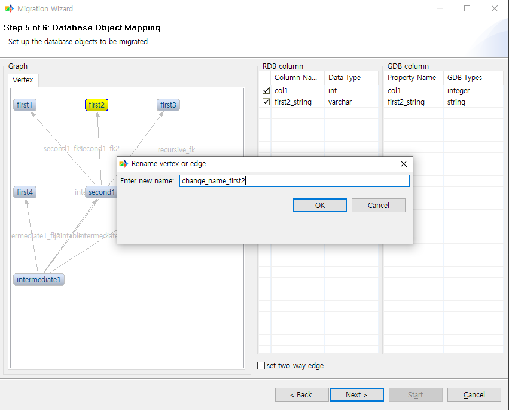
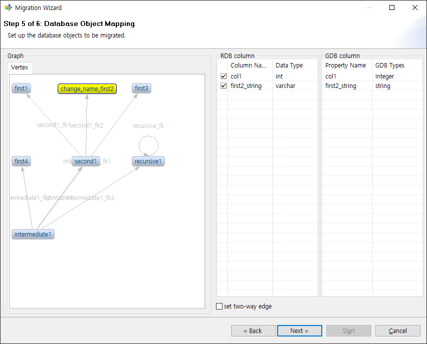
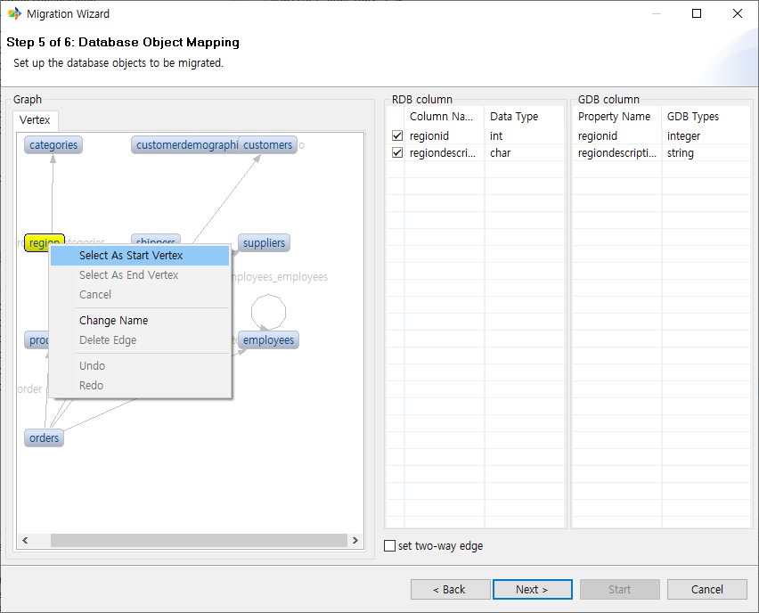
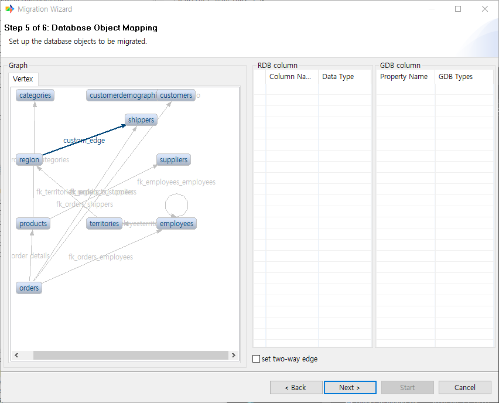

:meta-keywords: guide tool
:meta-description: Introducing the features of object mapping page

*******************************
객체 맵핑 페이지
*******************************

원본 DB의 테이블들 중에 이관하고싶은 테이블을 선택하는 페이지이다.

메뉴얼에서는 northwind sampleDB를 사용하였다.

==============
테이블 리스트
==============

원본 DB의 테이블 목록을 표시한다. 각 행을 클릭하여 이관 여부를 지정할 수 있다.
기본적으로 모든 테이블을 이관하도록 설정 되어있다.

==============
컬럼 리스트
==============

테이블 리스트에서 테이블을 선택한 경우 해당 테이블의 컬럼 정보를 확인할 수 있다.

ex) categories 테이블을 선택한 경우

이관할 테이블을 선택한 후 다음 페이지로 진행한다.

=======
그래프
=======

전 페이지에서 선택된 object들이 이관될 경우 GraphDB에서 어떻게 보이게 될지 예시를 보여준다.

==================
RDB, GDB 컬럼
==================

그래프 뷰에서 object를 선택한 경우 해당 object의 RDB에서의 컬럼 정보와 GDB에서의 컬럼 정보를 확인할 수 있다.

==================================
GDB 컬럼 데이터 타입 변경 기능
==================================

GDB column의 특정 데이터 타입은 변경이 가능하다.

현재는 자기 자신의 타입과, string으로의 타입 변경만을 지원한다.

========================
오브젝트 이름 변경 기능
========================

vertex 또는 edge의 이름을 수정할 수 있다.

방법은 아래와 같다

1. 이름을 수정하고 싶은 오브젝트를 우클릭한 후 Change Name을 선택한다

2. 원하는 이름을 입력하고 확인을 누른다

3. 수정된 것을 확인한다.

==============================
사용자 지정 edge 추가 기능
==============================

그래프 뷰에서 조건을 만족하는 경우 사용자가 edge를 추가할 수 있다

방법은 아래와 같다

1. 우선 start vertex로 지정할 vertex를 우클릭하여 선택한다.

2. end vertex로 지정할 vertex도 마찬가지로 우클릭하여 선택한다. start vertex를 선택하였다면 활성화 된다.

3. Create New Edge dialog에서 edge 이름을 입력한다.

4. 아래 테이블에서 FK를 연결할 컬럼을 선택한다. 이때 각 컬럼은 타입이 동일해야 한다.

5. 사용자 지정 edge가 생성된 것을 확인 할 수 있다.

========================
redo, undo 기능
========================

오브젝트 이름 변경, edge 추가 등의 기능을 수행한 뒤 취소하고 싶거나 다시 수행하고 싶은 경우 redo, undo 기능을 사용할 수 있다

방법은 아래와 같다

1. redo

1-1. 무언가 수정을 진행한 후 아무곳이나 선택 후 우클릭한다.

1-2. redo 버튼을 선택하면 가장 최근에 시행한 명령이 취소된다.

2. undo

2-1. 무언가 명령을 취소한 후 아무곳이나 선택 후 우클릭한다.

2-2. undo 버튼을 선택하면 취소됐던 명령이 다시 실행된다.