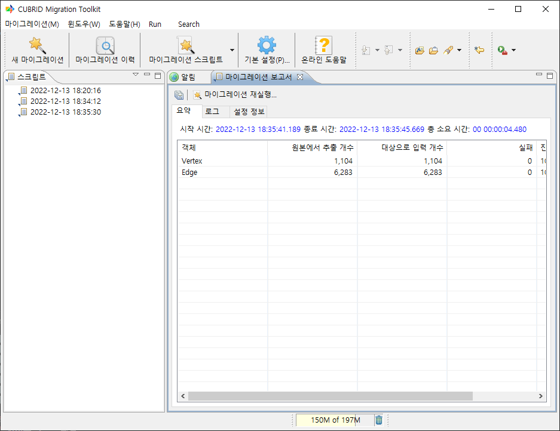
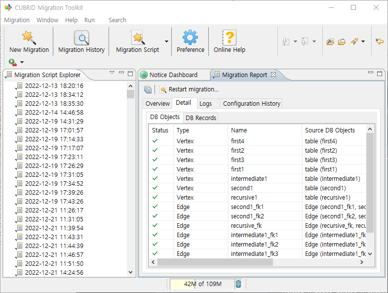
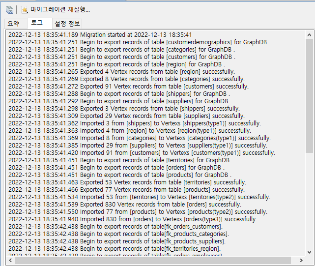
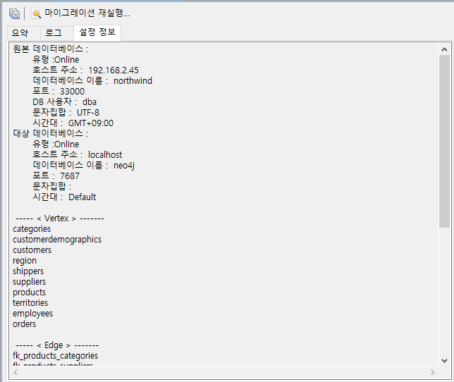

:meta-keywords: guide tool
:meta-description: Introducing the features of migration page

**********************
이관 보고서
**********************

이관 완료 후 결과를 표시한다.

=====
요약
=====

vertex와 edge의 추출 개수, 입력 개수, 실패한 개수, 진행도 등을 확인할 수 있다.

===========
상세 정보
===========

vertex, edge의 이관에 대한 상세한 정보를 확인할 수 있다.

.. /image:: ./image/detail_info.png

- status: 이관 성공, 실패 여부를 알려준다.

- type: 이관된 object의 vertex, edge, join table edge 여부를 표시한다.

- name: object의 이름을 표시한다.

- source db object: RDB의 어떤 object가 이관되면서 변경된 것인지 표시한다.

=====
로그
=====

이관 진행 페이지에서 console 화면에 표시되었던 내용이 저장된다.

===========
설정 정보
===========

이관 확인 페이지에서 표시되었던 정보들을 확인할 수 있다.