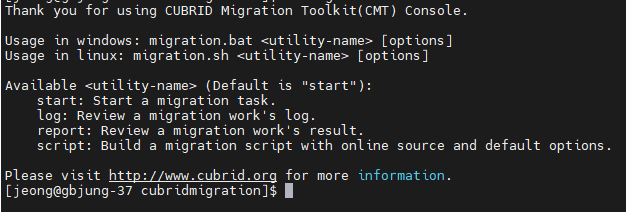

:meta-keywords: install, compatibility, run 
:meta-description: supported platforms, hardware and software requirements. How to install

*************
프로그램 소개
*************

본 프로그램은 IITP에서 CUBRID (RDB)와 TurboGraph++ (GDB)간의 DB object, record등의 정보를 이관할 수 있도록 개발된 Eclipce RCP 기반의 도구이다.

==============
주요 기능
==============

----------------------------
RDB to GDB 데이터 이관
----------------------------

.. image:: image/MiT_structure.png

주요 기능은 RDB(CUBRID)에서 table, index, fk를 추출하여 MiT내부에서 알고리즘에 따라 총 5가지 GDB 오브젝트로 분류 후 GDB(TurboGraph++)로 이관하는 기능이다.

추후 GDB -> RDB 기능이 추가 될 예정이다.

--------------
데이터 맵핑
--------------

추후 R2G, G2R 이관 시 각 column의 데이터 타입을 선택하여 이관하는 기능이 추가될 예정이다.

-----------------
CLI 이관
-----------------

이관 후 출력된 script 파일을 기반으로 CLI환경에서도 이관을 실행할 수 있는 기능을 추가 예정이다.

위 그림은 예시이다.
