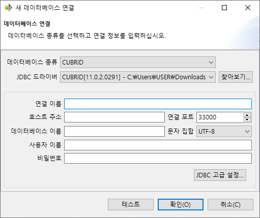
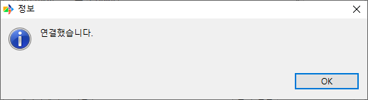

:meta-keywords: graph tools
:meta-description: Chapter contains useful information on starting Program.

********
시작하기
********

본 프로그램을 처음 사용하는데 참고할 수 있는 간략한 사용법을 설명한다. 

========================
공통 부분
========================

MiT의 기능 대부분에 공통으로 적용되는 기능이다.

----------------------------
이관 타입 선택
----------------------------

이관을 실행하기 위해 '새 마이그레이션' 버튼을 선택하면 표시되는 화면.

RDB to RDB 또는 GDB to GDB 이관은 불가능하다.

source type
================

화면의 왼쪽 영역에 해당하는 부분이다.

target으로 이관할 데이터를 가져올 source를 선택하는 부분이다.

현재 선택 가능한 DBMS는 CUBRID, Tibero, NEO4J, turbograph++가 있다.

현재 GraphDB는 CUBRID와 Tibero에 대한 출력만 지원한다 (G2R)

destination type
================

화면의 오른쪽 영역에 해당하는 부분이다.

target의 출력을 어떻게 할 것인지 설정하는 부분이다.

Online CUBRID database
------------------------

target을 CUBRID로 설정한다. 해당 옵션은 source가 GraphDB일 때만 지원한다.

Online Tibero database
-------------------------

target을 Tibero로 설정한다. 해당 옵션은 source가 GraphDB일 때만 지원한다.

Online Neo4j database
------------------------

target을 Neo4j로 설정한다. 해당 옵션은 source가 CUBRID 또는 Tibero일 때만 사용 가능하다.

Local GRAPH dump files
------------------------

target을 dump file로 설정한다. 해당 옵션은 source가 CUBRID 또는 Tibero일 때만 사용 가능하다.

Local CSV dump files
------------------------

target을 csv file로 설정한다. 해당 옵션은 source가 CUBRID 또는 Tibero일 때만 사용 가능하다.

----------------------------------------
연결 선택
----------------------------------------

원본DB의 connection을 관리한다.

.. image:: getting_start/R2G/image/select_src_conn_page.png

미리 생성된 연결을 선택하거나 유효한 연결을 새로 생성하여 선택한 뒤 대상DB 선택 페이지 또는 다른 설정 페이지로 진행할 수 있다.

연결 생성
=============

connection을 생성한다

데이터베이스 종류
------------------

현재 선택된 데이터베이스의 타입을 나타낸다. 현재 원본 DB는 CUBRID가 유일하다.

JDBC 드라이버 선택
---------------------

찾아보기를 눌러 JDBC 드라이버를 추가할 수 있다. 만약 한번 진행했을 경우 dropbox 메뉴를 통해 기존에 사용했던 JDBC를 사용할 수 있다.

연결 이름
------------------------

원본 DB 선택 페이지에서 보여질 이름을 입력할 수 있다.

호스트 주소
------------------------

원본 DB가 있는 IP주소를 입력한다.

연결 포트
------------------------

DB의 포트 번호를 입력한다. 기본값은 CUBRID의 기본 포트인 33000으로 되어있다.

데이터베이스 이름
------------------------

원본 DB내부의 schema또는 DB이름을 입력한다. (ex. CUBRID의 샘플DB인 demodb, NEO4J의 샘플DB인 neo4j)

문자 집합
------------------------

원본 DB에서 사용중인 인코딩 타입을 설정한다. CUBRID가 지원하는 인코딩 타입은 아래와 같다.

* UTF-8(기본)
* MS949
* ISO-8859-1
* EUC-KR
* EUC-JR
* GB2312
* GBK

사용자 이름
-------------------------

DB에 접속하기 위한 계정 이름을 입력한다.

비밀번호
-------------------------

계정의 비밀번호를 입력한다.

JDBC 고급 설정
-------------------------

JDBC URL을 커스텀 할 수 있다. 만약 DB연결시 parameter가 필요할 경우 해당 옵션에서 사용할 수 있다.

.. image:: getting_start/R2G/image/select_src_custom_url.png

테스트
========================

입력된 정보를 통해 연결을 테스트한다. 

=================
이후 진행
=================

각 이관 기능 별 세부 사항은 다음을 참고한다.

.. toctree::
    :titlesonly:
    :maxdepth: 1

    getting_start/0.RDB_to_GDB.rst
    getting_start/1.GDB_to_RDB.rst
    getting_start/2.RDB_to_dump.rst
    getting_start/3.RDB_to_csv.rst
    getting_start/4.CLI.rst
